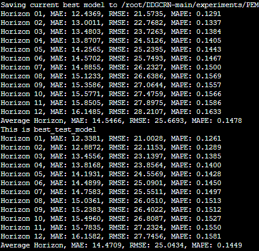
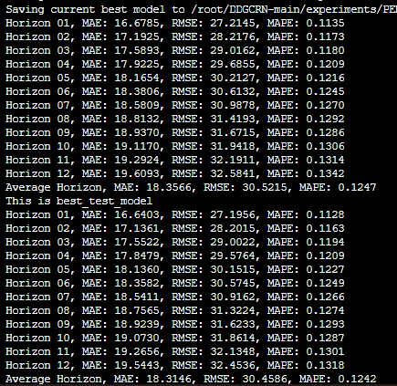
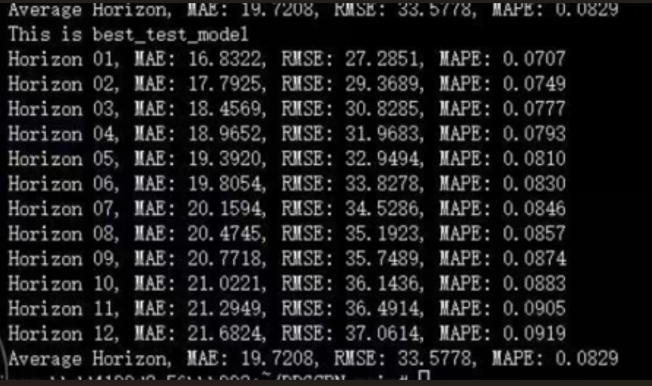
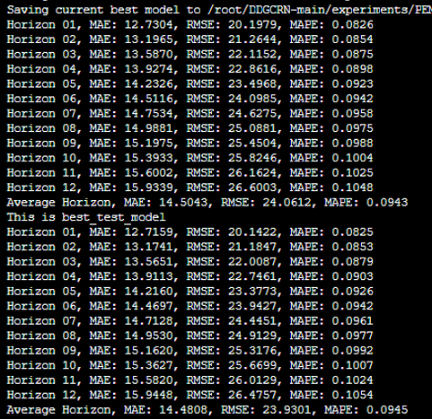

# DGCRN-TSA
A novel deep learning framework for accurate traffic flow prediction using dynamic graph structures and temporal self-attention.


ProjectName and Description

<!-- PROJECT SHIELDS -->

[![Contributors][contributors-shield]][contributors-url]
[![Forks][forks-shield]][forks-url]
[![Stargazers][stars-shield]][stars-url]
[![Issues][issues-shield]][issues-url]
[![MIT License][license-shield]][license-url]
[![LinkedIn][linkedin-shield]][linkedin-url]

<!-- PROJECT LOGO -->
<br />

<p align="center">
  <a href="https://github.com/shaojintian/Best_README_template/">
   
  </a>

  <h3 align="center">Dynamic Graph Convolutional Recurrent Network with Temporal Self-Attention for Accurate Traffic Flow Prediction</h3>
  <p align="center">
       <br />
    <a href="https://github.com/lixin8383/DGCRN-TSA/edit/main/README.md"><strong>Explore the documentation for this project»</strong></a>
    <br />
  
  </p>

</p>


<!-- 目录 -->
<details>
  <summary>目录</summary>
  <ol>
    <li>
      <a href="#About item">About item</a>
      <ul>
        <li><a href="#Building Tools">Building Tools</a></li>
      </ul>
    </li>
    <li>
      <a href="#开始">Key Features</a>
      <ul>
        <li><a href="#Datasets">Datasets</a></li>
        <li><a href="#Dependencies">Dependencies</a></li>
        <li><a href="#Dounting">Dounting</a></li>
      </ul>
    </li>
    <li><a href="#Experimental Results">Experimental Results</a></li>
    <li><a href="#Model Architecture">Model Architecture</a></li>
    <li><a href="#贡献">贡献</a></li>
    <li><a href="#许可证">许可证</a></li>
    <li><a href="#联系我们">联系我们</a></li>
    <li><a href="#致谢">致谢</a></li>
  </ol>
</details>


<!-- About item -->
## 🚦 About item

Traffic flow prediction is a critical task for modern Intelligent Transportation Systems (ITS). Most existing Graph Convolutional Networks (GCNs) rely on predefined or static adjacency matrices, limiting their ability to capture dynamically changing spatial-temporal dependencies in traffic data.

To address this, we propose DGCRN-TSA – a Dynamic Graph Convolutional Recurrent Network with Temporal Self-Attention. This model is capable of generating dynamic graph structures, identifying and modeling anomalous signals, and enhancing temporal feature learning for improved prediction accuracy.

<p align="right">(<a href="#top">Back to top</a>)</p>


### 🧠 Building Tools

* [Bootstrap](https://getbootstrap.com)
* [JQuery](https://jquery.com)

<p align="right">(<a href="#top">Back to top</a>)</p>

<!-- Key Features -->
## ✨ Key Features

  Dynamic Graph Generation: Learns spatial dependencies adaptively from traffic signal sequences, without relying on prior knowledge.

  Temporal Self-Attention: Enhances the model's ability to capture long-term dependencies in traffic flows using a trend-aware multi-head attention mechanism.

  Anomaly-Aware Prediction: Distinguishes between normal and abnormal traffic patterns and models them separately.

  Encoder-Decoder Architecture: Employs dynamic graph convolutional recurrent units (DGCRUs) to encode and decode spatiotemporal representations.

### 🗂️ Datasets

This repository houses all objects associated with the storage, loading, and summarization of data-sets from the Caltrans Performance Measurement System (PeMS).https://github.com/SANDAG/PeMS-Datasets

We evaluated DGCRN-TSA on four real-world datasets from the California Department of Transportation PeMS system:

  ```sh
  *   Dataset | Sensors | Time Span       | Missing Rate
  *   PeMS03  | 358     | 09/2018–11/2018 | 0.672%
  *   PeMS04  | 307     | 01/2018–02/2018 | 3.182%
  *   PeMS07  | 883     | 05/2017–08/2017 | 0.452%
  *   PeMS08  | 170     | 07/2016–08/2016 | 0.696%

  ```
### 🧱 Dependencies

* npm
  ```sh
  npm install npm@latest -g
  ```

### 📁 Dounting

1. Install the python program.
2. clone library
   ```sh
   git clone https://github.com/lixin8383/DGCRN-TSA/.git
   ```
3. Installing the JQuery package
   ```sh
   JQuery install
   ```
4. Run the run.py program
   ```js
   run.py ;
   ```

<p align="right">(<a href="#top">Back to top</a>)</p>


## 🛠 Experimental Results

DGCRN-TSA outperforms 21 baseline models, including ARIMA, LSTM, TCN, DCRNN, Graph WaveNet, and STGODE. On all datasets, it achieves state-of-the-art accuracy in terms of MAE, RMSE, and MAPE.

Example (PeMS08):

  ```sh
  Model     | MAE   | RMSE    | MAPE
  LSTM      | 22.19 | 33.59   | 18.74%
  STGODE    | 16.81 | 25.97   | 10.62%
  DGCRN-TSA | 14.48 | 23.93   | 9.45%

  ```
## 🧩 Model Architecture

The DGCRN-TSA consists of:

Input & Preprocessing Module

Spatiotemporal Representation Evolution (STRE) Module

Dynamic Graph Convolution (DGC)

Node Dynamic Adaptation (NDA)

Spatiotemporal Embedding Generator (STEG)

Temporal Attention Module

Output & Prediction Module

<p align="center">  </p>

## 🔧 Training Configuration

Optimizer: Adam

Loss Function: MAE

Hidden Units: 64

Prediction Horizon: 12

Batch Size: 64 (16 for PeMS07)

Learning Rate: 0.03 (0.0075 for PeMS07)

## 🧪 Ablation Study

We compared three variants:

  *  w/o DGGN (no dynamic graph)

  *  w/o TAttn (no temporal attention)

  *  w/o NDA (no node dynamic adaptation)

All variants underperformed compared to the full DGCRN-TSA model, confirming the importance of each module.

## 📈 Computational Efficiency
  ```sh
  Model	Train Time (s/epoch)	Inference Time (s)
  AGCRN	6.5	1.1
  STGODE	35.2	4.1
  DGCRN-TSA	28.5	2.5
  ```
## 📚 Citation

  ```sh
@article{DGCRN-TSA2025,
  title={Dynamic Graph Convolutional Recurrent Network with Temporal Self-Attention for Accurate Traffic Flow Prediction},
  author={Xin Li, Yongsheng Qian, Minan Yang, Junwei Zeng, Futao Zhang},
  journal={To be published},
  year={2025}
}

  ```

## 🎯 Result

- <p align="center">
  <a href="https://github.com/lixin8383/DGCRN-TSA/blob/main/result/03.png">
    
  </a>
- <p align="center">
  <a href="https://github.com/lixin8383/DGCRN-TSA/blob/main/result/04.png">
    
  </a>
- <p align="center">
  <a href="https://github.com/lixin8383/DGCRN-TSA/blob/main/result/07.png">
    
  </a>
- <p align="center">
  <a href="https://github.com/lixin8383/DGCRN-TSA/blob/main/result/08.png">
    
  </a>

<!-- 贡献 -->
## 🤝 贡献

贡献让开源社区成为了一个非常适合学习、启发和创新的地方。你所做出的任何贡献都是**受人尊敬**的。

如果你有好的建议，请复刻（fork）本仓库并且创建一个拉取请求（pull request）。你也可以简单地创建一个议题（issue），并且添加标签「enhancement」。不要忘记给项目点一个 star！再次感谢！

1. 复刻（Fork）本项目
2. 创建你的 Feature 分支 (`git checkout -b feature/AmazingFeature`)
3. 提交你的变更 (`git commit -m 'Add some AmazingFeature'`)
4. 推送到该分支 (`git push origin feature/AmazingFeature`)
5. 创建一个拉取请求（Pull Request）

<p align="right">(<a href="#top">Back to top</a>)</p>


<!-- 许可证 -->
## 许可证

根据 MIT 许可证分发。打开 [LICENSE.txt](LICENSE.txt) 查看更多内容。


<p align="right">(<a href="#top">Back to top</a>)</p>


<!-- 联系我们 -->
## 联系我们

你的名字 - [@your_twitter](https://twitter.com/your_username) - email@example.com

项目链接: [https://github.com/your_username/repo_name](https://github.com/your_username/repo_name)

<p align="right">(<a href="#top">Back to top</a>)</p>


<!-- 致谢 -->
## 致谢

在这里列出你觉得有用的资源，并以此致谢。我已经添加了一些我喜欢的资源，以便你可以快速开始！

* [Choose an Open Source License](https://choosealicense.com)
* [GitHub Emoji Cheat Sheet](https://www.webpagefx.com/tools/emoji-cheat-sheet)
* [Malven's Flexbox Cheatsheet](https://flexbox.malven.co/)
* [Malven's Grid Cheatsheet](https://grid.malven.co/)
* [Img Shields](https://shields.io)
* [GitHub Pages](https://pages.github.com)
* [Font Awesome](https://fontawesome.com)
* [React Icons](https://react-icons.github.io/react-icons/search)

<p align="right">(<a href="#top">Back to top</a>)</p>


<!-- MARKDOWN 链接 & 图片 -->
<!-- https://www.markdownguide.org/basic-syntax/#reference-style-links -->
[contributors-shield]: https://img.shields.io/github/contributors/BreakingAwful/Best-README-Template-zh.svg?style=for-the-badge
[contributors-url]: https://github.com/BreakingAwful/Best-README-Template-zh/graphs/contributors
[forks-shield]: https://img.shields.io/github/forks/BreakingAwful/Best-README-Template-zh.svg?style=for-the-badge
[forks-url]: https://github.com/BreakingAwful/Best-README-Template-zh/network/members
[stars-shield]: https://img.shields.io/github/stars/BreakingAwful/Best-README-Template-zh.svg?style=for-the-badge
[stars-url]: https://github.com/BreakingAwful/Best-README-Template-zh/stargazers
[issues-shield]: https://img.shields.io/github/issues/BreakingAwful/Best-README-Template-zh.svg?style=for-the-badge
[issues-url]: https://github.com/BreakingAwful/Best-README-Template-zh/issues
[license-shield]: https://img.shields.io/github/license/BreakingAwful/Best-README-Template-zh.svg?style=for-the-badge
[license-url]: https://github.com/BreakingAwful/Best-README-Template-zh/blob/master/LICENSE.txt
[linkedin-shield]: https://img.shields.io/badge/-LinkedIn-black.svg?style=for-the-badge&logo=linkedin&colorB=555
[linkedin-url]: https://linkedin.com/in/othneildrew
[product-screenshot]: images/screenshot.png


# Introduction to DGCRN-TSA
Precision in traffic flow prediction represents a pivotal technology within the domain of Intelligent Transportation Systems (ITS), playing a critical role in the planning of future trips, the enhancement of urban transportation efficiency, and the support of decision-making processes by traffic management authorities. Current mainstream graph-convolutional networks predominantly depend on a priori knowledge to depict the spatial dependencies of road networks in the context of predefined adjacency matrices. However, the predefined or adaptive adjacency matrices employed for such static modeling of spatial dependencies are challenging to accurately reflect the dynamically changing spatial associations between road segments over time, thus limiting the precise prediction of traffic flow. To address this challenge, a Dynamic Graph Convolutional Recurrent Network and Temporal Self-Attention (DGCRN-TSA) is proposed for traffic flow prediction. The proposed method integrates a dynamic graph convolutional recurrent network with a recurrent neural network-based dynamic graph generation model to construct a dynamic graph from time-varying traffic signals, facilitating the simultaneous extraction of spatial and temporal features. Additionally, the model separates abnormal signals from normal traffic signals and employs a data-driven approach to model abnormal signals, thereby further enhancing the prediction efficacy. The model incorporates a novel temporal attention mechanism, which utilizes local contextual information to enhance the transformation of numerical sequence representations. This mechanism enables the prediction model to capture dynamic temporal dependencies in traffic flows, thereby contributing to long-term prediction. An analysis of four real datasets revealed that DGCRN-TSA outperforms current state-of-the-art prediction methods in terms of performance.

# PeMS-Datasets
This repository houses all objects associated with the storage, loading, and summarization of data-sets from the Caltrans Performance Measurement System (PeMS).https://github.com/SANDAG/PeMS-Datasets

## PeMS data-sets location and acquisition
PeMS data-sets come from the PeMS Data Clearinghouse located at http://pems.dot.ca.gov/. To access the PeMS Data Clearinghouse it is necessary to create a user-name and password.

To download the data-sets it is recommended to use a batch downloader browser extension as Caltrans purposefully disallows the use of programmatic tools to access the data-sets. Once the data-sets of interest are downloaded ensure there are no duplicate files or empty files as this is not an uncommon occurrence in the Data Clearinghouse.

## Loading PeMS data-sets
The final destination of the PeMS data-sets is an internal SQL server instance specified in the Python file main.py of the project python folder. 

Once the data-sets are downloaded, placed in the project data folder, and ready to be loaded into the SQL server instance; ensure the PeMS SQL objects created by the pemsObjects.sql file in the project sql folder exist in the target database of interest. If they do not exist, or it is wished to completely start anew, run the pemsObjects.sql in the target database of interest to drop and create all PeMS related SQL objects.

Create the Python interpreter from the provided environment.yml file located in the Python folder of the project. Set the interpreter as the default Python interpreter associated with this project. Run the Python file main.py from the project python folder. It will sequentially load the  data-sets of interest from the data folder, extracting the necessary txt files from the compressed gz files and zip archives, and load them directly into the SQL database of interest specified in the Python file main.py.

## Summarizing PeMS data-sets
Stored procedures within the database containing the PeMS data-sets provide yearly aggregations of the PeMS data-sets at the station level for user-specified time resolutions. For more information, refer to this GitHub's Wiki page for each PeMS data-set.

## Matching PeMS stations to SANDAG highway network
A Python micro-service is included in the project matching folder that matches a user-specified year of PeMS station metadata loaded into an internal SQL server instance with a user-specified SANDAG highway network e00 file. The Python script can be run outside of the project folder structure and includes a separate environment.yml file from the main project.

## Acquisition of support
This work was supported in part by the 2025 Gansu Provincial Department of Education Excellent Graduate Students “Innovation Star” Program(2025CXZX-645); National Natural Science Foundation of China Western Program (72361017; 52362047; 71861024); Gansu Provincial Key R&D Program (21YF5GA052); Gansu Provincial Natural Science Foundation Program (18JR3RA119); Gansu Higher Education Institutions Industrial Support Program in 2021 (2021CYZC-60); Gansu Provincial Department of Education Key Project of “Double First-class” Scientific Research (GSSYLXM-04); Natural Science Foundation of Gansu (23JRRA904).
