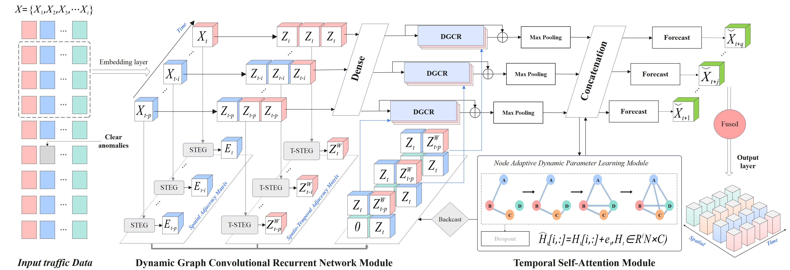

# DGCRN-TSA
A novel deep learning framework for accurate traffic flow prediction using dynamic graph structures and temporal self-attention.


ProjectName and Description

<!-- PROJECT SHIELDS -->

[![Contributors][contributors-shield]][contributors-url]
[![Forks][forks-shield]][forks-url]
[![Stargazers][stars-shield]][stars-url]
[![Issues][issues-shield]][issues-url]
[![MIT License][license-shield]][license-url]
[![LinkedIn][linkedin-shield]][linkedin-url]

<!-- PROJECT LOGO -->
<br />

<p align="center">
  <a href="https://github.com/shaojintian/Best_README_template/">
   
  </a>

  <h3 align="center">Dynamic Graph Convolutional Recurrent Network with Temporal Self-Attention for Accurate Traffic Flow Prediction</h3>
  <p align="center">
       <br />
    <a href="https://github.com/lixin8383/DGCRN-TSA/edit/main/README.md"><strong>Explore the documentation for this project»</strong></a>
    <br />
  
  </p>

</p>


<!-- summary -->
<details>
  <summary>Summary</summary>
  <ol>
    <li>
      <a href="#About item">About item</a>
      <ul>
        <li><a href="#Building Tools">Building Tools</a></li>
      </ul>
    </li>
    <li>
      <a href="#开始">Key Features</a>
      <ul>
        <li><a href="#Datasets">Datasets</a></li>
        <li><a href="#Dependencies">Dependencies</a></li>
        <li><a href="#Dounting">Dounting</a></li>
      </ul>
    </li>
    <li><a href="#Experimental Results">Experimental Results</a></li>
    <li><a href="#Model Architecture">Model Architecture</a></li>
    <li><a href="#Acquisition of support">Acquisition of support</a></li>
    <li><a href="#MIT License">MIT License</a></li>
    <li><a href="#Contact Us">Contact Us</a></li>
    <li><a href="#Acknowledgement">Acknowledgement</a></li>
  </ol>
</details>


<!-- About item -->
## 🚦 About item

Traffic flow prediction is a critical task for modern Intelligent Transportation Systems (ITS). Most existing Graph Convolutional Networks (GCNs) rely on predefined or static adjacency matrices, limiting their ability to capture dynamically changing spatial-temporal dependencies in traffic data.

To address this, we propose DGCRN-TSA – a Dynamic Graph Convolutional Recurrent Network with Temporal Self-Attention. This model is capable of generating dynamic graph structures, identifying and modeling anomalous signals, and enhancing temporal feature learning for improved prediction accuracy.

<p align="right">(<a href="#top">Back to top</a>)</p>


### 🧠 Building Tools

* [Bootstrap](https://getbootstrap.com)
* [JQuery](https://jquery.com)

<p align="right">(<a href="#top">Back to top</a>)</p>

<!-- Key Features -->
## ✨ Key Features

  Dynamic Graph Generation: Learns spatial dependencies adaptively from traffic signal sequences, without relying on prior knowledge.

  Temporal Self-Attention: Enhances the model's ability to capture long-term dependencies in traffic flows using a trend-aware multi-head attention mechanism.

  Anomaly-Aware Prediction: Distinguishes between normal and abnormal traffic patterns and models them separately.

  Encoder-Decoder Architecture: Employs dynamic graph convolutional recurrent units (DGCRUs) to encode and decode spatiotemporal representations.

### 🗂️ Datasets

This repository houses all objects associated with the storage, loading, and summarization of data-sets from the Caltrans Performance Measurement System (PeMS).https://github.com/SANDAG/PeMS-Datasets

We evaluated DGCRN-TSA on four real-world datasets from the California Department of Transportation PeMS system:

  ```sh
  *   Dataset | Sensors | Time Span       | Missing Rate
  *   PeMS03  | 358     | 09/2018–11/2018 | 0.672%
  *   PeMS04  | 307     | 01/2018–02/2018 | 3.182%
  *   PeMS07  | 883     | 05/2017–08/2017 | 0.452%
  *   PeMS08  | 170     | 07/2016–08/2016 | 0.696%

  ```
PeMS data-sets come from the PeMS Data Clearinghouse located at http://pems.dot.ca.gov/. To access the PeMS Data Clearinghouse it is necessary to create a user-name and password.

To download the data-sets it is recommended to use a batch downloader browser extension as Caltrans purposefully disallows the use of programmatic tools to access the data-sets. Once the data-sets of interest are downloaded ensure there are no duplicate files or empty files as this is not an uncommon occurrence in the Data Clearinghouse.

### 🧱 Dependencies

* npm
  ```sh
  npm install npm@latest -g
  ```

### 📁 Dounting

1. Install the python program.
2. clone library
   ```sh
   git clone https://github.com/lixin8383/DGCRN-TSA/.git
   ```
3. Installing the JQuery package
   ```sh
   JQuery install
   ```
4. Run the run.py program
   ```js
   run.py
   ```

<p align="right">(<a href="#top">Back to top</a>)</p>


## 🛠 Experimental Results

DGCRN-TSA outperforms 21 baseline models, including ARIMA, LSTM, TCN, DCRNN, Graph WaveNet, and STGODE. On all datasets, it achieves state-of-the-art accuracy in terms of MAE, RMSE, and MAPE.

Example (PeMS08):

  ```sh
  Model     | MAE   | RMSE    | MAPE
  LSTM      | 22.19 | 33.59   | 18.74%
  STGODE    | 16.81 | 25.97   | 10.62%
  DGCRN-TSA | 14.48 | 23.93   | 9.45%

  ```
## 🧩 Model Architecture

The DGCRN-TSA consists of:

Input & Preprocessing Module

Spatiotemporal Representation Evolution (STRE) Module

Dynamic Graph Convolution (DGC)

Node Dynamic Adaptation (NDA)

Spatiotemporal Embedding Generator (STEG)

Temporal Attention Module

Output & Prediction Module

<br />
<div align="lift">
  <a href="https://github.com/lixin8383/DGCRN-TSA/blob/main/fig3.png">
    
  </a>
  <h3 align="center">Best-README-Template-zh</h3>
  
## 🔧 Training Configuration

Optimizer: Adam

Loss Function: MAE

Hidden Units: 64

Prediction Horizon: 12

Batch Size: 64 (16 for PeMS07)

Learning Rate: 0.03 (0.0075 for PeMS07)

## 🧪 Ablation Study

We compared three variants:

  *  w/o DGGN (no dynamic graph)

  *  w/o TAttn (no temporal attention)

  *  w/o NDA (no node dynamic adaptation)

All variants underperformed compared to the full DGCRN-TSA model, confirming the importance of each module.

## 📈 Computational Efficiency
  ```sh
  Model	Train Time (s/epoch)	Inference Time (s)
  AGCRN	6.5	1.1
  STGODE	35.2	4.1
  DGCRN-TSA	28.5	2.5
  ```
## 📚 Citation

  ```sh
@article{DGCRN-TSA2025,
  title={Dynamic Graph Convolutional Recurrent Network with Temporal Self-Attention for Accurate Traffic Flow Prediction},
  author={Xin Li, Yongsheng Qian, Minan Yang, Junwei Zeng, Futao Zhang},
  journal={To be published},
  year={2025}
}

  ```

## 🎯 Result

- <p align="center">
  <a href="https://github.com/lixin8383/DGCRN-TSA/blob/main/result/03.png">
    
  </a>
- <p align="center">
  <a href="https://github.com/lixin8383/DGCRN-TSA/blob/main/result/04.png">
    
  </a>
- <p align="center">
  <a href="https://github.com/lixin8383/DGCRN-TSA/blob/main/result/07.png">
    
  </a>
- <p align="center">
  <a href="https://github.com/lixin8383/DGCRN-TSA/blob/main/result/08.png">
    
  </a>

<!-- 贡献 -->
## 🤝 Acquisition of support
This work was supported in part by the 2025 Gansu Provincial Department of Education Excellent Graduate Students “Innovation Star” Program(2025CXZX-645); National Natural Science Foundation of China Western Program (72361017; 52362047; 71861024); Gansu Provincial Key R&D Program (21YF5GA052); Gansu Provincial Natural Science Foundation Program (18JR3RA119); Gansu Higher Education Institutions Industrial Support Program in 2021 (2021CYZC-60); Gansu Provincial Department of Education Key Project of “Double First-class” Scientific Research (GSSYLXM-04); Natural Science Foundation of Gansu (23JRRA904).

<p align="right">(<a href="#top">Back to top</a>)</p>


<!-- MIT License -->
## MIT License

MIT License

Copyright (c) 2025 Xin Li, Yongsheng Qian, Minan Yang,
Junwei Zeng, Futao Zhang

Permission is hereby granted, free of charge, to any person obtaining a copy
of this software and associated documentation files (the “Software”), to deal
in the Software without restriction, including without limitation the rights
to use, copy, modify, merge, publish, distribute, sublicense, and/or sell
copies of the Software, and to permit persons to whom the Software is
furnished to do so, subject to the following conditions:

The above copyright notice and this permission notice shall be included in
all copies or substantial portions of the Software.

THE SOFTWARE IS PROVIDED “AS IS”, WITHOUT WARRANTY OF ANY KIND, EXPRESS OR
IMPLIED, INCLUDING BUT NOT LIMITED TO THE WARRANTIES OF MERCHANTABILITY,
FITNESS FOR A PARTICULAR PURPOSE AND NONINFRINGEMENT. IN NO EVENT SHALL THE
AUTHORS OR COPYRIGHT HOLDERS BE LIABLE FOR ANY CLAIM, DAMAGES OR OTHER
LIABILITY, WHETHER IN AN ACTION OF CONTRACT, TORT OR OTHERWISE, ARISING FROM,
OUT OF OR IN CONNECTION WITH THE SOFTWARE OR THE USE OR OTHER DEALINGS IN
THE SOFTWARE.


<p align="right">(<a href="#top">Back to top</a>)</p>


<!-- Contact Us -->
## Contact Us

Xin Li - [@ email](lixin@bnmun.com)

Project Links: [https://github.com/lixin8383/DGCRN-TSA]

<p align="right">(<a href="#top">Back to top</a>)</p>


<!-- Acknowledgement -->
## Acknowledgement
Thank you to all those who participated and provided support for this project!
* [Choose an Open Source License](https://choosealicense.com)
* [GitHub Emoji Cheat Sheet](https://www.webpagefx.com/tools/emoji-cheat-sheet)
* [Malven's Flexbox Cheatsheet](https://flexbox.malven.co/)


<p align="right">(<a href="#top">Back to top</a>)</p>


<!-- MARKDOWN 链接 & 图片 -->
<!-- https://www.markdownguide.org/basic-syntax/#reference-style-links -->
[contributors-shield]: https://img.shields.io/github/contributors/BreakingAwful/Best-README-Template-zh.svg?style=for-the-badge
[contributors-url]: https://github.com/BreakingAwful/Best-README-Template-zh/graphs/contributors
[forks-shield]: https://img.shields.io/github/forks/BreakingAwful/Best-README-Template-zh.svg?style=for-the-badge
[forks-url]: https://github.com/BreakingAwful/Best-README-Template-zh/network/members
[stars-shield]: https://img.shields.io/github/stars/BreakingAwful/Best-README-Template-zh.svg?style=for-the-badge
[stars-url]: https://github.com/BreakingAwful/Best-README-Template-zh/stargazers
[issues-shield]: https://img.shields.io/github/issues/BreakingAwful/Best-README-Template-zh.svg?style=for-the-badge
[issues-url]: https://github.com/BreakingAwful/Best-README-Template-zh/issues
[license-shield]: https://img.shields.io/github/license/BreakingAwful/Best-README-Template-zh.svg?style=for-the-badge
[license-url]: https://github.com/BreakingAwful/Best-README-Template-zh/blob/master/LICENSE.txt
[linkedin-shield]: https://img.shields.io/badge/-LinkedIn-black.svg?style=for-the-badge&logo=linkedin&colorB=555
[linkedin-url]: https://linkedin.com/in/othneildrew
[product-screenshot]: images/screenshot.png


